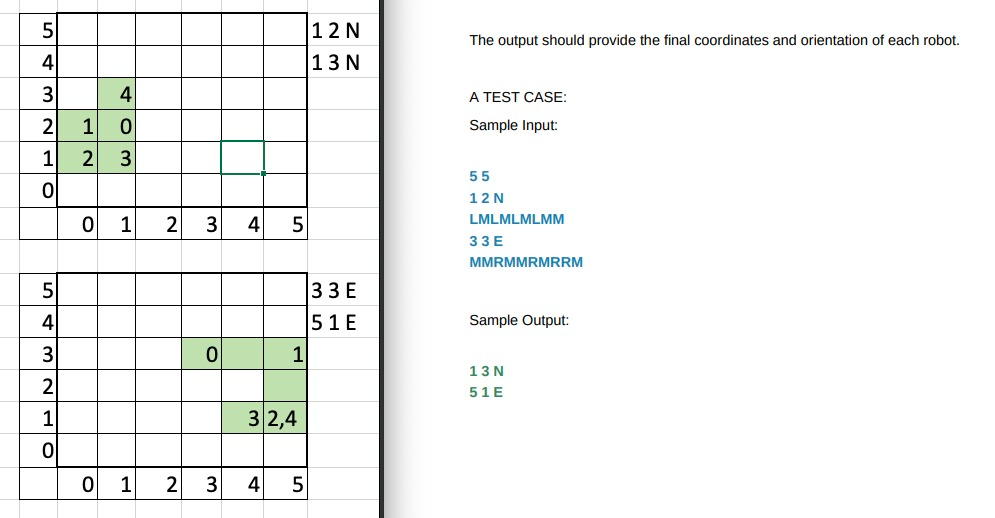

# cleaning-robots
Service to describe how to move a cleaning robot getting an initial position and a list of steps

### Carlos Andres Valencia Rojas
peluka613@gmail.com

## The challenge
Volkswagen digital:hub has been tasked with an essential project. We need to create
an application that helps control innovative autonomous cleaning robots at the
Volkswagen Wolfsburg Factory. Volkswagen has introduced state-of-the-art robotic
cleaners that can efficiently clean the factory floor and utilize their cameras to inspect
the environment, identifying any issues or hazards in the workspaces. Our autonomous
cleaning robots are truly impressive!
  
For the pilot test of our cleaning robot, we have selected a rectangular factory floor
that is currently vacant and free of obstacles. This floor will provide an ideal testing
Our impressive robot cleaners ground for our robot, allowing us to evaluate its capabilities in a controlled environment.
The robot will be tasked with cleaning the entire floor, including hard-to-reach corners
and crevices. We believe that this test will demonstrate the effectiveness of our robot's
cleaning mechanism, as well as its ability to navigate around obstacles and operate
autonomously.   
With this successful pilot test, we will be one step closer to launching our
cleaning robot into the market, and providing an innovative solution to the challenges of
industrial cleaning.
  
A cleaning robot's position and orientation is represented by its X and Y coordinates and
a letter representing one of the four cardinal compass points (N, E, S, W).  
The workspace where the robot operates is divided up into a grid to simplify navigation. For
instance, an example position of the robot could be 0, 0, N, which indicates that the
robot is at the bottom-left corner and facing North.
Here you can see the floor that the robot will be cleaning. As you can see, it's quite dirty
  
To control the robot, the Maintenance Department sends a string of instructions
consisting of the letters "L", "R", and "M". The letter "L" makes the robot spin 90 degrees
left, "R" makes it spin 90 degrees right, and "M" tells it to move forward one grid point in
the same direction it is facing.
 
It is important to note that the square directly North of (X, Y) is (X, Y + 1).
  
The input for the robot control consists of two lines. The first line is the upper-right
coordinates of the workspace, with the bottom-left coordinates assumed to be 0, 0. The
second line provides information on the robots deployed. Each robot is represented by
two lines. The first line specifies its position, while the second line is a series of
instructions telling the robot how to explore the workspace.
  
Each robot operates sequentially, meaning that the second robot will start moving only
after the first one has finished.
The robot cleaner at 0,0, N
  
The output should provide the final coordinates and orientation of each robot.
A TEST CASE:  
Sample Input: 
5 5 
1 2 N 
LMLMLMLMM 
3 3 E 
MMRMMRMRRM  
Sample Output: 
1 3 N 
5 1 E  

 

### Technical decisions

### Language

As a lack of knowledge about Kotlin I decide to use Java 8 then invest time getting the Kotlin basics during the next days.

### Framework

I decided to use Spring Boot as a framework because it is the one I know better and it is also compatible with Kotlin besides other languages available for the JVM

### Architecture

Despite I do not have any experience with hexagonal architecture I invested more of the time in investigating and implementing at least its basics, I understand it is a modular and maintainable architecture

I organized the packages according to the hexagonal architecture layers additionally an exceptions package for specific domain error handling as follows

- adapter
- application
- domain
- exceptions
- ports

### Domain

Contains the domain objects encapsulating states and behavior to make a coherent division

### Application

Contains the service as use cases and the logic, error handling and connecting between the ports

### Ports

Are the interfaces that define the contracts to be followed by the custom adapters and encapsulate the core of the application independent

### Adapter

Contains the custom adapters implementing the port interfaces, I created two examples, a web input and a log output, the ports allows to create any variety of adapters to configure any kind of inputs and outputs

### Exceptions 

Package that contains custom exceptions meant to lead to a clearer error handling and error responses, I tried to cover most of the possible failures 

### Testing

Implemented using JUnit 5, Mockito was not needed because of the simplicity of the adapters, I didn't use any external dependency that could be mocked

I invested more time ensuring domain and application coverage and testing logic, because of reasons of time I didn't covered ports and adapters, but I hope you can observe I can maintain a high coverage 

## Run the application

As it is a simple SpringBoot Application you just need to run CleaningRobotsApplication class, I attached a postman collection with the request needed to run the WebController what is the input adapter

## Output results

Implemented a simple console log adapter to transform and shw the expected results

